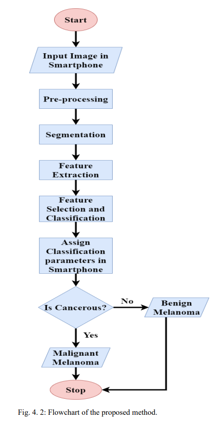
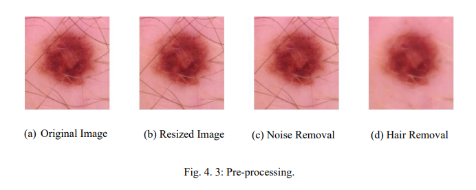
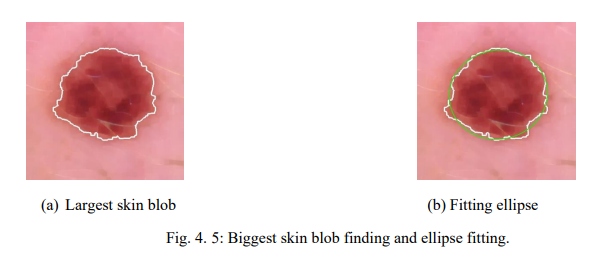
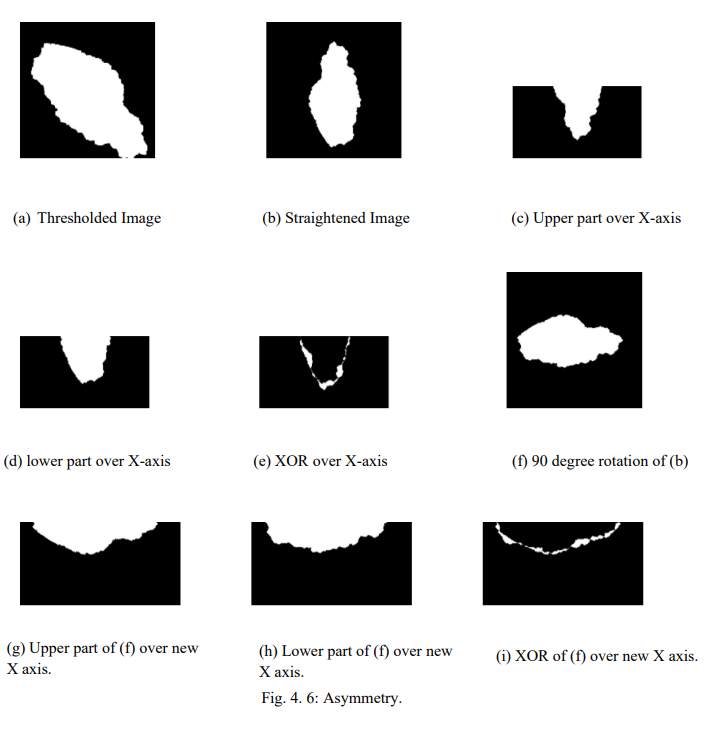
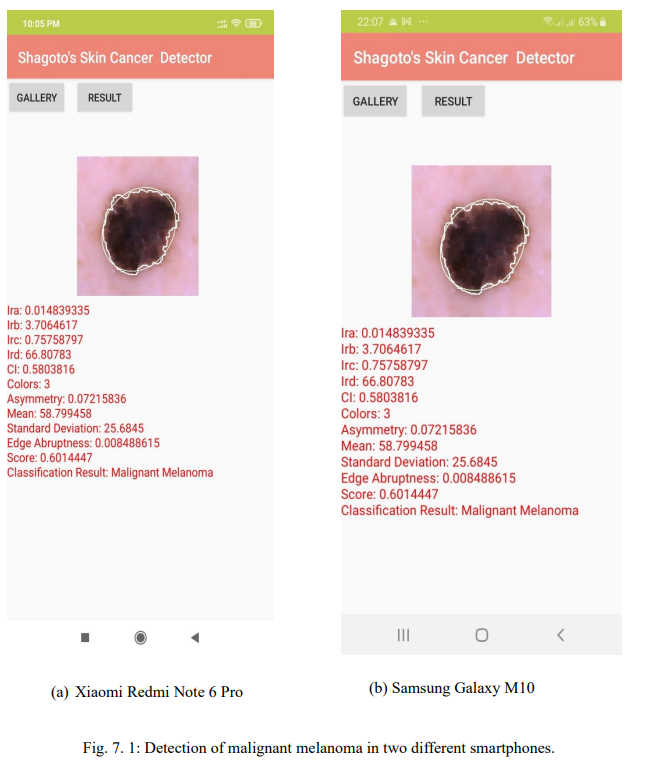
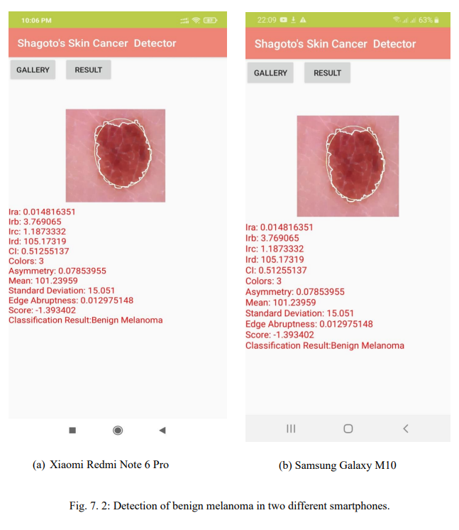

# Smartphone-based-Skin-Cancer-Detection-using-Image-Processing-and-Support-Vector-Machine.-




---

## 📌 Overview

This project implements an asymmetry detection algorithm using:
- **Otsu's Thresholding**
- **OpenCV for Image Processing**
- **Java-based implementation**

It computes **horizontal and vertical asymmetries** by analyzing differences in pixel intensities across divided regions of a binary image.

---

## 📦 Technologies Used

- 📱 Android (Java)
- 🧪 OpenCV 4.x (Java + Python)
- 🐍 Python 3.9+
- 📊 scikit-learn, pandas, matplotlib
- 📷 MediaStore, Bitmap processing
- 💾 SVM, Chi-Square, Correlation

---

## 🔍 Features Extracted

From each lesion image, **10 features** are extracted and used for classification:

- Geometric features (area, perimeter, symmetry)
- Edge abruptness
- Color diversity
- RGB standard deviation and mean
- Elliptical irregularity
- Centroid-based radial distances

These are processed using Java & OpenCV directly on the smartphone app.

---

## 🧠 4.2.4 Feature Selection and Classification

### 📌 4.2.4.1 Support Vector Machine (SVM)

- Used for classifying skin lesions as **benign** or **malignant**.
- SVM is selected over Decision Trees and Naive Bayes due to better performance with continuous features and large datasets.
- CHI Square test and correlation among feature have been done.
---

## 📂 Directory Structure
```
asymmetry-detector/
├── java codes
│ └── Main.java
├── python codes/
│ ML related analysis
```







